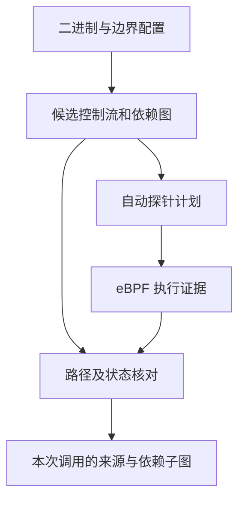

# 静态候选依赖与选择性 eBPF 观测：第一阶段

本阶段验证：配置函数边界和输入/输出字段后，能否从实际二进制自动构建候选依赖、生成探针计划，再通过执行证据排除错误来源。算法不读取夹具的预期来源，也没有按函数名字编写传播规则。

**当前状态：开发端静态分析、指令模拟和原生夹具输出检查通过；新采集器的真实 BCC/eBPF 运行待用户主机验证。**旧版六次赋值的真实采集成功不能替代本版验证。

## 主机执行

沿用已经能加载 BCC 的 Linux x86-64 / WSL2 环境，Python 3.10+，GCC 和 binutils。无需 Docker，也无需安装 Unicorn。

```bash
git pull origin main
sudo /usr/bin/python3 scripts/hybrid_provenance.py run
```

成功或失败均回传 `artifacts/hybrid-provenance-*.zip`。

只构建二进制、依赖图及探针计划：

```bash
python3 scripts/hybrid_provenance.py build
```

`build_verified` 仅证明本次构建能被分析；`ebpf_checks_passed` 才表示本次实际采集和夹具验证通过。遇到不支持的指令、循环或布局会失败并打包原因，不会自动降级为数值匹配。

## 静态部分具体做了什么

本版静态输入是 GCC 编译出的 ELF 和 `objdump` 指令，不是完整 C AST/LLVM 分析。它直接连接静态指令位置与 uprobe 位置，避免把源码行号误当成机器地址。业务字段名称、函数范围和敏感属性仍由配置提供。

1. 按符号地址与长度提取完整函数，解码支持的指令，建立控制流图。拒绝间接跳转、调用、循环和越界跳转。
2. 在最多 128 条指令、256 条候选路径的范围内枚举无环路径。静态阶段保留两个条件分支，不根据测试输入提前选路。
3. 每条路径维护寄存器定义和两个声明内存区域的字段定义。复制、运算建立依赖，字段写入进行强更新，因此后续写入可以清除旧来源。支持的地址形式是寄存器基址加常量偏移。
4. 从最终响应字段反向查依赖，并保留分支条件的依赖、函数入口/返回及分支后继观测点，自动生成探针集合。

`config.json` 配置函数符号、连续 uint32 输入/输出字段、sink 和敏感字段。构建时额外生成 `_Static_assert`，用 `sizeof/offsetof` 验证配置与 C 结构布局一致。配置没有逐条指令位置、source→sink 对应答案或预期分支。

该方案仍解析范围内的全部指令，也可能为状态核对读取不直接影响 sink 的输入字段；“选择性”指只在部分指令位置挂探针，不表示已获得最少观测点或最小数据读取量。

## 动态部分具体做了什么

- 每个探针只绑定本次启动的子进程。沿用已验证的 PID 限定方式，不把命名空间内的 Python PID 与内核 TGID 直接做数值比较。
- 入口建立调用序号并保存输入/输出基址。每个事件携带调用内序号、指令位置、寄存器、条件标志、字段快照和内存读取返回码；返回点结束本次调用。
- 用实际 ELF 映射核验运行地址；按观测位置序列匹配候选 CFG 路径，再核对分支结果、寄存器和内存状态。未挂探针的指令由明确的指令模型解释，其结果必须与后续观测相容。
- 只从保留下来的路径取最终 sink 的依赖祖先。跨分支共享同一个加载位置时使用各路径自己的依赖边，避免从静态并集图误带入另一来源。
- 输出调用实例内的依赖子图，节点标明哪些操作有直接观测、哪些依赖静态模型。节点的调用编号存在分析器中，不加入业务数据。



缺失/重复事件、读取失败、地址不匹配、分支或状态矛盾均不能生成确定来源。剩余多条相容路径会报告 `ambiguous`。采集丢失、计数异常、目标退出失败或整次调用缺失会使整体评估失败，不能通过只保留成功样例掩盖问题。

## 四类夹具与真值隔离

| 函数 | 验证内容 |
| --- | --- |
| `choose_value` | 两个字段数值相同，实际选择不同来源；无关 audit 写入用于检查缩小范围 |
| `overwrite_value` | 敏感来源先写入，随后被普通来源覆盖；使用 volatile 保留两次真实写操作 |
| `alias_value` | 源码通过指针选择字段；当前 GCC 构建优化成分支加载，不能声称验证了通用堆别名 |
| `transform_value` | XOR 后与另一个字段相加；正确结果可以同时依赖两个来源 |

两组数值，每类两种选择，共 16 次调用。`main.c` 是独立测试驱动和预期来源定义，`operations.c` 没有日志、标签、USDT 或追踪调用。编译器可能优化源码，因此评估解释始终以保存的实际二进制为准。

`infer(events, plans, config, runtime_bases)` 不接受 stdout/真值。只有最终 `evaluate` 读取 `program.stdout.jsonl`。评估同时核对来源集合、出口数值、调用身份及采集质量，并独立计算静态候选关系与动态结果的 precision/recall。

准确率单位是“某次调用的出口字段与来源字段之间的关系”，不是所有语句边的 recall。当前真值不覆盖整个进程的任意数据。

## 开发端验证记录（2026-09-30）

GCC 13.3.0，固定 `-O1` 等构建参数；独立 Unicorn 2.1.4 执行实际 ELF 中的机器字节，在计划位置生成**模拟事件**。测试没有用本项目的解释器生成事件。另一方面，编译出的 C 程序在开发机原生执行，输出作为独立评估输入。

| 检查 | 本地结果 |
| --- | --- |
| 新旧完整单元测试 | 60 项通过，包含本版 10 项；本次已安装可选 Unicorn，没有跳过相关测试 |
| 指令数 / 选择位置数 | 35 / 26；不等于开销降低比例 |
| 模拟事件 / 调用数 | 88 / 16 |
| 静态候选来源关系 | TP=20，FP=8，FN=0 |
| 结合模拟执行证据后的来源关系 | TP=20，FP=0，FN=0 |
| 自动适配检查 | 函数改名、地址改变、输入字段顺序调整、XOR 常量改变后重新构建通过 |
| 异常检查 | 缺事件、重复、读取失败、寄存器/标志/内存矛盾、错误地址、整次调用缺失均拒绝通过 |
| 真实 eBPF 采集 | **待主机运行；此表不能作为内核采集成功证据** |

开发环境没有 BCC，ptrace 也被环境禁止；没有通过额外权限绕过这些限制。主机生成的指令与事件数量可能因编译器而不同，验收不写死 26/88。

开发测试的可选依赖及命令（建议使用现有开发虚拟环境）：

```bash
python3 -m pip install -r tests/hybrid-requirements.txt
python3 -m unittest discover -s tests -v
```

未安装 Unicorn 时相关模拟执行测试会明确显示 skipped；主机 BCC 采集本身不依赖 Unicorn。

## 结果包

| 文件 | 用途 |
| --- | --- |
| `sources/`、`config.json`、`build-identity.json` | 本次构建源码、声明布局、编译器和校验和 |
| `hybrid-demo`、`disassembly.txt` | 实际目标程序和机器指令 |
| `probe-plan.json` | 每条候选路径、依赖边、静态来源、自动选择的位置 |
| `collector.bpf.c`、`collector.log` | 实际生成的 BPF 代码及加载诊断 |
| `target-process.json`、`target-maps.txt`、`runtime-bases.json` | 进程和加载地址核验 |
| `attached-probes.json`、`events.jsonl`、`capture.json` | 挂接记录、原始观测、错误/丢失计数 |
| `inferred.json` | 每次调用的来源集合、依赖子图和拒绝原因 |
| `program.stdout.jsonl`、`evaluation.json` | 独立夹具输出及关系级评分 |
| `result.json` | 成功状态或失败阶段 |

## 明确暂不覆盖

本版只支持单线程、非递归、无调用的原生叶函数，两个明确布局且不重叠的内存区域，部分 32 位操作及简单地址复制。分支证据用于确定实际数据来源，**不把控制条件作为隐式污点来源输出**。

不支持循环、任意堆对象/字符串、动态分配、跨调用持久状态、线程共享、Java/JIT、跨服务和 MQ。源码字段标识及敏感属性来自配置；地址关系分析仅限此封闭模型。候选路径枚举也不具备大型程序的扩展性。

它提供的是后续算法的可执行验证骨架。若此轮主机通过，再选择一种真实程序操作扩展语义；不要把结果直接写成 Sock Shop 的字段血缘准确率或对 FlowDist/MirrorTaint 的性能优势。
